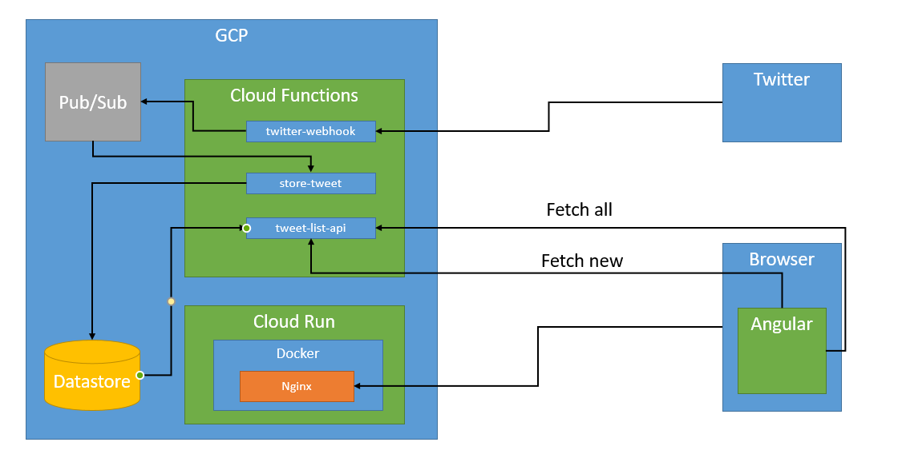

# Exercise 2 - Twitter integration
## Architecture
Overview:

### Tweets
New tweets are being send by twitter via web hook to **twitter-webhook**.

### twitter-webhook
GCP function triggered by HTTP request. It validated twitter event and send it topic in Pub/Sub.

### store-twitter
GCP function triggered by topic event. It read data from twitter event convert it to known model and stores to DB (Datastore in this case)

### tweet-list-api
GCP function triggered by HTTP request. It reads tweets from DB and sends them as response.
It can filter tweets by creation date, so it can be used to check for tweets created after last execution.

### tweet-list (Angular)
Angular application which fetch tweets from **tweet-list-api** and displayes them. Periodicaly checks if new tweets are avaiable but sending request to **tweet-list-api** with filer for tweet creation date.

Appliaction is being deployed into docker container and run by Cloud Run.
